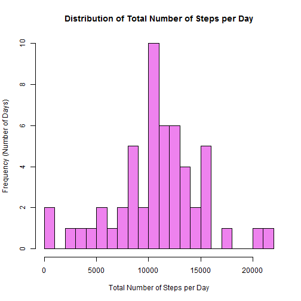
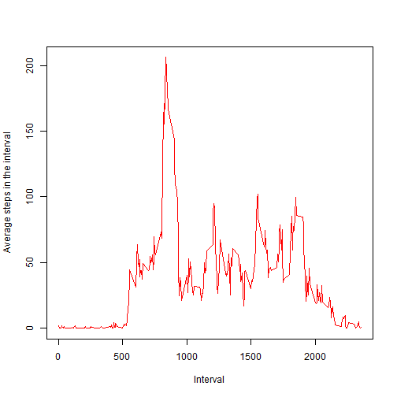
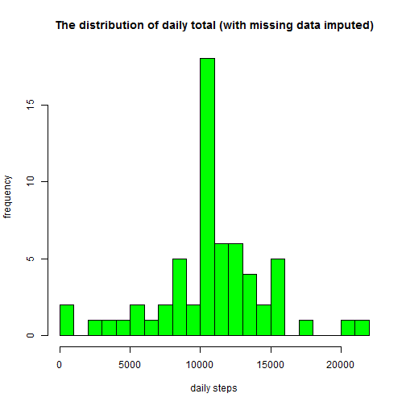

Reproducible Research: Peer Assessment 1
========================================

##Introduction
This assignment makes use of data from a personal activity monitoring device. This device collects data at 5 minute intervals through out the day. The data consists of two months of data from an anonymous individual collected during the months of October and November, 2012 and include the number of steps taken in 5 minute intervals each day.

##Data
The data is Fork/clone the GitHub repository created for this assignment. The data for this assignment can also be downloaded from the course web site. 

####Packages used for this assignment

library(dplyr)

library(lattice)

##Loading and preprocessing data
The working directory has been set to the cloned repo i.e RepData_PeerAssessment1. The data is available in the name of "activity.csv" file.

###Reading in the data

```r
data <- read.csv("activity.csv",header=TRUE,sep = ',',na.strings="NA")
```
Structure of the dataset

```r
str(data)
```

```
## 'data.frame':	17568 obs. of  3 variables:
##  $ steps   : int  NA NA NA NA NA NA NA NA NA NA ...
##  $ date    : Factor w/ 61 levels "2012-10-01","2012-10-02",..: 1 1 1 1 1 1 1 1 1 1 ...
##  $ interval: int  0 5 10 15 20 25 30 35 40 45 ...
```
First few rows of the dataset

```r
head(data)
```

```
##   steps       date interval
## 1    NA 2012-10-01        0
## 2    NA 2012-10-01        5
## 3    NA 2012-10-01       10
## 4    NA 2012-10-01       15
## 5    NA 2012-10-01       20
## 6    NA 2012-10-01       25
```
There are 3 variables with 17568 observations


##1.What is mean total number of steps taken per day
Calculating the total number of steps per day and ignoring NA's

```r
stepsperday <- tapply(data$steps, data$date, sum, na.rm=FALSE, simplify=T)
```
First few rows of the dataset stepsperday

```r
head(stepsperday)
```

```
## 2012-10-01 2012-10-02 2012-10-03 2012-10-04 2012-10-05 2012-10-06 
##         NA        126      11352      12116      13294      15420
```

Plotting a histogram for daily total number of steps

```r
hist(stepsperday, 
     main = "Distribution of Total Number of Steps per Day", 
     xlab = "Total Number of Steps per Day", 
     ylab = "Frequency (Number of Days)", 
     breaks=20,   col = "violet")
```



Mean & Median of the total number of steps taken per day

```r
mean(stepsperday,na.rm = TRUE)
```

```
## [1] 10766.19
```

```r
median(stepsperday,na.rm = TRUE)
```

```
## [1] 10765
```

##2. What is the average daily activity pattern?
Computation of the average number of steps for 5-minute interval


```r
AvgStepsPerInterval <- tapply(data$steps, data$interval, mean, na.rm=TRUE, simplify=T)
df_ia <- data.frame(interval=as.integer(names(AvgStepsPerInterval)), avg=AvgStepsPerInterval)
```

A time series plot is created with type="l"

```r
with(df_ia,
     plot(interval,
          avg,
          type="l",
          col="red",
          xlab="Interval",
          ylab="Average steps in the interval"))
```



Interval containing the maximum number of steps

```r
maxsteps <- max(df_ia$avg)
df_ia[df_ia$avg == maxsteps, ]
```

```
##     interval      avg
## 835      835 206.1698
```
Interval 835 has the maximum number of steps i.e 206

##3. Imputing missing values
Calculating the total number of rows with missing values

```r
sum(is.na(data$steps))
```

```
## [1] 2304
```
The original data has 2304 rows with missing values i.e NA's

We use the strategy of filling the missing values with mean of the interval

Creating a new dataset with the missing values replaced by mean of the interval

```r
data_impute <- data
newdata <- is.na(data_impute$steps)
AvgStepsPerInterval <- tapply(data$steps, data$interval, mean, na.rm=TRUE, simplify=T)
data_impute$steps[newdata] <- AvgStepsPerInterval[as.character(data_impute$interval[newdata])]
```
Plotting a histogram of the total number of steps taken each day

```r
NewAvgStepsPerInterval <- tapply(data_impute$steps, data_impute$date, sum, na.rm=TRUE, simplify=T)

hist(x=NewAvgStepsPerInterval,
     col="green",
     breaks=20,
     xlab="daily steps",
     ylab="frequency",
     main="The distribution of daily total (with missing data imputed)")
```



Calculating the mean & median of the new dataset

```r
mean(NewAvgStepsPerInterval)
```

```
## [1] 10766.19
```

```r
median(NewAvgStepsPerInterval)
```

```
## [1] 10766.19
```
Compared to the original median, the new median has a slight change

The impact of imputing missing data is that the new mean & median are equal to 10766

##4. Are there differences in activity patterns between weekdays and weekends?

Using the Weekday() function that indicates if a given day is a "weekday" or a "weekend"

```r
weekday.or.weekend <- function(date) {
    day <- weekdays(date)
    if (day %in% c("Monday", "Tuesday", "Wednesday", "Thursday", "Friday"))
        return("weekday")
    else if (day %in% c("Saturday", "Sunday"))
        return("weekend")
    else
        stop("invalid date")
}
data_impute$date <- as.Date(data_impute$date)
data_impute$day <- sapply(data_impute$date, FUN=weekday.or.weekend)
```
Checking the first few rows of the data_impute data 

```r
head(data_impute)
```

```
##       steps       date interval     day
## 1 1.7169811 2012-10-01        0 weekday
## 2 0.3396226 2012-10-01        5 weekday
## 3 0.1320755 2012-10-01       10 weekday
## 4 0.1509434 2012-10-01       15 weekday
## 5 0.0754717 2012-10-01       20 weekday
## 6 2.0943396 2012-10-01       25 weekday
```
Loading the lattice package for plotting

```r
library(lattice)
```

Creating a panel plot containing a time series plot (i.e type="l")

```r
wk_df <- aggregate(steps ~ day+interval, data=data_impute, FUN=mean)
xyplot(steps ~ interval | factor(day),
       layout = c(1, 2),
       xlab="Interval",
       ylab="Number of steps",
       type="l",
       lty=1,
       data=wk_df)
```


The following conclusion can be derived from the above plots:

1. The person seems to be active earlier during weekdays than weekends
2. Activity in weekends is higher than weekdays during the later part of the day 
